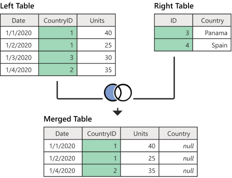

# Window Functions

Functions that perform calculation and optionally an ordering within a specific partition

```
SELECT
    department_id,
    employee_id,
    salary,
    AVG(salary) OVER (PARTITION BY department_id ORDER BY salary DESC) AS avg_salary_per_department
FROM
    employees;
```

```
window_avg_salary_per_department = Window.partitionBy(col("department_id")).orderBy(col("salary").desc())

employees_table.select(
    department_id,
    employee_id,
    salary,
    avg(salary).over(window_avg_salary_per_department).alias("avg_salary_per_department")
)
```

other examples of build in functions: [link](https://sparkbyexamples.com/pyspark/pyspark-window-functions/)


# Anti Join

A way to filter rows from a table



# union

A function that combines the rows of two DataFrames

```
df1 = spark.createDataFrame([(1, 'A'), (2, 'B')], ['id', 'value'])
df2 = spark.createDataFrame([(3, 'C'), (4, 'D')], ['id', 'value'])
df3 = df1.union(df2)
df3.show()
```

# Exercise 3

- Create a table that groups by product and seller
- Define window functions for the ordering
- Use `dense_rank()`
- Create a table for the exceptions
- Create two tables for the objectives
- Combine all those tables to get the answer
- Show the answer for product 0

# Exercise 3 Extra

- create a df like this:

```
data = [('James', 34, 55000), ('Michael', 30, 70000), ('Robert', 37, 60000), ('Maria', 29, 80000), ('Jen', 32, 65000)]
df = spark.createDataFrame(data, ["name", "age" , "salary"])
df.show()
```

- Calculate the difference between the salary between two consecutive columns. You can use `monotonically_increasing_id()` and `lag()`

- create a df like this:

```
data = [
    Row(id=1, column1=5),
    Row(id=2, column1=8),
    Row(id=3, column1=12),
    Row(id=4, column1=1),
    Row(id=5, column1=15),
    Row(id=6, column1=7),
]
df = spark.createDataFrame(data)
df.show()
```

- Get the row number of the 3rd largest value
